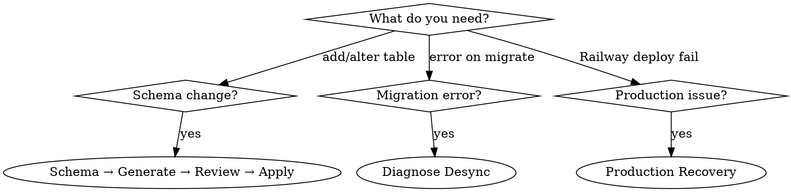

# Drizzle Migrations

## Overview

Complete migration lifecycle for the ToStudy monorepo: schema change, generation, review, apply, troubleshoot, and production recovery. Migrations live in `packages/database/migrations/` and are tracked by a three-part system (SQL files + journal + DB table).

## When to Use



## Quick Reference

| Action | Command |
|--------|---------|
| Generate migration | `pnpm db:generate` |
| Apply migrations | `pnpm db:migrate` |
| Push schema (dev only) | `pnpm db:push` |
| Open Drizzle Studio | `pnpm db:studio` |
| Validate state | `pnpm db:validate` |
| Regenerate sync SQL | `pnpm db:sync-hashes` |
| Run seed | `pnpm db:seed` |
| Extended seed | `pnpm db:seed:extended` |
| Dev seed | `pnpm db:seed:dev` |

## Migration Workflow

### Step 1: Edit Schema

All schema files in `packages/database/src/schema/`. Edit the relevant file or create a new one.

**New table checklist:**
- [ ] UUID primary key with `defaultRandom()`
- [ ] `createdAt` / `updatedAt` timestamps with timezone
- [ ] Foreign keys with explicit `onDelete` behavior
- [ ] Indexes on FK columns and frequent WHERE/ORDER BY columns
- [ ] Export table + relations + inferred types from `schema/index.ts`

### Step 2: Generate Migration

```bash
pnpm db:generate
```

This creates a new SQL file in `packages/database/migrations/` and updates `migrations/meta/_journal.json`.

**CRITICAL: Rename the file** if Drizzle generated a random name (e.g., `0201_jittery_shadowcat.sql`):

```bash
# Rename to descriptive name
mv migrations/0201_jittery_shadowcat.sql migrations/0201_add_bookmarks_table.sql
```

Then update the `tag` field in `_journal.json` to match.

### Step 3: Review Migration SQL

**ALWAYS review before committing.** Check for:

| Check | Action |
|-------|--------|
| Mega-migration (>50KB, 10+ CREATE TYPE) | Delete, reset local DB, regenerate incrementally |
| Missing `IF NOT EXISTS` on CREATE | Add for safety |
| Destructive DDL (DROP TABLE/COLUMN) | Confirm intentional, add data backup step |
| Enum changes (ADD VALUE) | Cannot be in a transaction block in PG < 12 |
| Data migration mixed with DDL | Split into separate migrations |

### Step 4: Apply Migration

```bash
pnpm db:migrate
```

### Step 5: Validate

```bash
pnpm db:validate
```

## Schema Patterns

### Table Definition

```typescript
export const bookmarks = pgTable("bookmarks", {
  id: uuid("id").defaultRandom().primaryKey(),
  userId: uuid("user_id")
    .references(() => users.id, { onDelete: "cascade" })
    .notNull(),
  courseId: uuid("course_id")
    .references(() => courses.id, { onDelete: "cascade" })
    .notNull(),
  notes: text("notes"),
  metadata: jsonb("metadata").$type<{ tags?: string[] }>(),
  createdAt: timestamp("created_at", { withTimezone: true })
    .defaultNow()
    .notNull(),
  updatedAt: timestamp("updated_at", { withTimezone: true })
    .defaultNow()
    .notNull(),
}, (table) => ({
  userIdx: index("bookmarks_user_id_idx").on(table.userId),
  courseIdx: index("bookmarks_course_id_idx").on(table.courseId),
  userCourseIdx: index("bookmarks_user_course_idx")
    .on(table.userId, table.courseId),
}));
```

### Enums

```typescript
export const bookmarkTypeEnum = pgEnum("bookmark_type", [
  "lesson",
  "module",
  "course",
]);

// Type extraction
export type BookmarkType = typeof bookmarkTypeEnum.enumValues[number];
```

### Relations

```typescript
export const bookmarksRelations = relations(bookmarks, ({ one }) => ({
  user: one(users, {
    fields: [bookmarks.userId],
    references: [users.id],
  }),
  course: one(courses, {
    fields: [bookmarks.courseId],
    references: [courses.id],
  }),
}));
```

### Type Exports

```typescript
// In schema/index.ts
export type Bookmark = typeof schema.bookmarks.$inferSelect;
export type NewBookmark = typeof schema.bookmarks.$inferInsert;
```

### Index Patterns

```typescript
// Simple index
userIdx: index("bookmarks_user_id_idx").on(table.userId),

// Composite index (column order matters for query optimization)
userCourseIdx: index("bookmarks_user_course_idx")
  .on(table.userId, table.courseId),

// Partial index (in migration SQL)
// CREATE INDEX "idx_bookmarks_active" ON "bookmarks"
//   USING btree ("user_id") WHERE "is_active" = true;

// GIN index for JSONB
// CREATE INDEX "idx_bookmarks_metadata" ON "bookmarks"
//   USING gin ("metadata");
```

## Data Seed Migrations

For seeding reference data (models, config, etc.), write INSERT migrations:

```sql
-- 0199_seed_gpt5_models.sql
INSERT INTO llm_model_pricing (
  model_id, provider, display_name, input_per_1m, output_per_1m, is_active
)
VALUES
  ('gpt-5', 'openai', 'GPT-5', 1.2500, 10.0000, true),
  ('gpt-5-mini', 'openai', 'GPT-5 Mini', 0.2500, 2.0000, true)
ON CONFLICT (model_id) DO UPDATE SET
  input_per_1m = EXCLUDED.input_per_1m,
  output_per_1m = EXCLUDED.output_per_1m,
  is_active = EXCLUDED.is_active;
```

**Always use `ON CONFLICT ... DO UPDATE`** for idempotent seed migrations.

## Migration State Tracking

```
SQL Files (207)  ←→  Journal (_journal.json, 201 entries)  ←→  DB Table (__drizzle_migrations)
```

| Component | Location | Purpose |
|-----------|----------|---------|
| SQL files | `migrations/*.sql` | Actual DDL/DML statements |
| Journal | `migrations/meta/_journal.json` | Tracks generated migrations (idx, tag, timestamp) |
| DB table | `drizzle.__drizzle_migrations` | Hash + created_at of applied migrations |

## Diagnosing Desync

```bash
# 1. Count SQL files
ls packages/database/migrations/*.sql | wc -l

# 2. Count journal entries
cat packages/database/migrations/meta/_journal.json | jq '.entries | length'

# 3. Count DB migrations
docker exec cursos-postgres psql -U postgres -d cursos \
  -c "SELECT COUNT(*) FROM drizzle.__drizzle_migrations"

# 4. Find orphaned files (not in journal)
cd packages/database && for f in migrations/*.sql; do
  name=$(basename "$f" .sql)
  grep -q "\"$name\"" migrations/meta/_journal.json || echo "ORPHANED: $name"
done
```

| Symptom | Cause | Fix |
|---------|-------|-----|
| DB count < journal | Migrations not applied | `pnpm db:migrate` |
| SQL file not in journal | Orphaned migration | Add to journal or archive |
| Hash mismatch | File edited after apply | Restore from git or update hash in DB |
| Journal idx gaps | Entries deleted | Reconstruct journal |
| Duplicate prefixes | Parallel development | Safe if both in journal |

## Production Recovery (Railway)

### "type already exists" / "relation already exists"

```bash
# 1. Identify failing migration from logs
railway logs -n 200 -d <deployment-id>

# 2. Connect to production DB
railway connect postgres

# 3. Check if object exists
SELECT typname FROM pg_type WHERE typname = 'my_enum';
SELECT table_name FROM information_schema.tables WHERE table_name = 'my_table';

# 4. Mark migration as applied (skip it)
INSERT INTO drizzle.__drizzle_migrations (hash, created_at)
VALUES ('<md5-hash>', <timestamp_from_journal>)
ON CONFLICT DO NOTHING;

# 5. Redeploy
railway redeploy --service web --yes
```

### Mega-Migration Prevention

| Red Flag | Action |
|----------|--------|
| Migration > 50KB | DELETE it, regenerate incrementally |
| 10+ CREATE TYPE in one file | Mega-migration detected |
| 20+ CREATE TABLE in one file | Mega-migration detected |
| Generated after local DB reset | Will try to recreate everything |

**Recovery:** Delete mega-migration, sync local DB to production schema, generate only incremental changes.

## Common Mistakes

| Mistake | Correct |
|---------|---------|
| Edit applied migration | Create new migration (forward-only) |
| Skip reviewing generated SQL | ALWAYS review before commit |
| Generate on clean/reset DB | Generate incrementally from current state |
| Random migration names | Rename to `NNNN_descriptive_name.sql` + update journal tag |
| Mix DDL + data migration | Split into separate migrations |
| Run `db:push` in production | NEVER. Use `db:migrate` only |
| Forget to export types | Add `$inferSelect` / `$inferInsert` to `schema/index.ts` |
| Missing FK indexes | Always index foreign key columns |
| `timestamp` without timezone | Always use `{ withTimezone: true }` |
| Enum without type export | Export `typeof enum.enumValues[number]` |

## Naming Conventions

| Element | Convention | Example |
|---------|------------|---------|
| Migration file | `NNNN_descriptive_name.sql` | `0201_add_bookmarks_table.sql` |
| Table | snake_case, plural | `bookmarks`, `course_modules` |
| Column | snake_case | `user_id`, `created_at` |
| Index | `{table}_{columns}_idx` | `bookmarks_user_id_idx` |
| Enum | `{name}_enum` variable, snake_case DB name | `pgEnum("bookmark_type", [...])` |
| FK | `{referenced_table_singular}_id` | `user_id`, `course_id` |

## Reference

- **Schema files:** `packages/database/src/schema/`
- **Migrations:** `packages/database/migrations/`
- **Troubleshooting:** `packages/database/AGENTS.md` (Migration Troubleshooting section)
- **Local runbook:** `packages/database/docs/migration-maintenance.md`
- **Production runbook:** `packages/database/docs/migration-maintenance-production.md`
- **Repository pattern:** `packages/api/src/shared/infrastructure/repositories/` (ADR-0066)
- **Validation script:** `packages/database/scripts/validate-migrations.ts`
