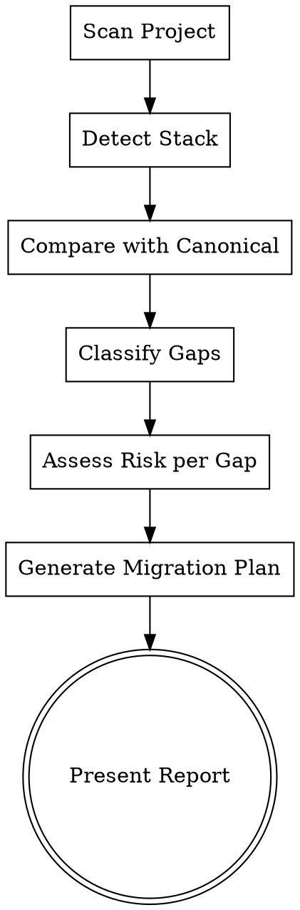
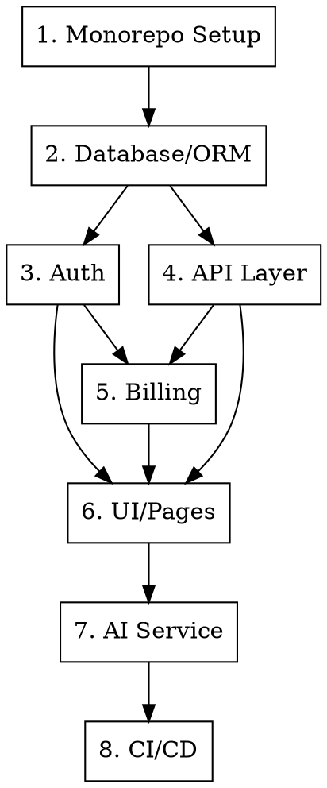

# SaaS Migration Audit — Stack Analysis & Migration Planning

Analisa um projeto JS/TS existente, compara com a stack canônica do `saas-bootstrap`, gera relatório de gaps com risco/esforço, e propõe plano de migração faseado.

<HARD-GATE>
NUNCA execute mudanças no código durante o audit. Esta skill é SOMENTE diagnóstico e planejamento. A execução da migração é uma tarefa separada que requer aprovação explícita do usuário após revisar o plano.
</HARD-GATE>

## Stack Canônica de Referência

| Camada | Target | Alternativas Reconhecidas |
|--------|--------|--------------------------|
| Monorepo | Turborepo + pnpm | Nx, Lerna, yarn workspaces, single-repo |
| Framework | Next.js 15+ (App Router) | Vite + React, Remix, Nuxt, SvelteKit |
| API | tRPC v11 | REST, GraphQL, Supabase client, fetch direto |
| ORM | Drizzle ORM | Prisma, TypeORM, Sequelize, Supabase JS, Knex |
| Database | PostgreSQL (Neon) | Supabase DB, PlanetScale, MongoDB, SQLite |
| Auth | Auth.js v5 | Supabase Auth, Clerk, Lucia, Firebase Auth, custom JWT |
| Billing | Stripe (subs + metered) | LemonSqueezy, Paddle, custom, nenhum |
| AI Service | FastAPI (Python) | Supabase Edge Functions, Next.js API routes, Lambda |
| UI | PageShell + Tailwind + shadcn | Material UI, Chakra, Ant Design, CSS Modules, styled-components |
| Deploy | Vercel + Railway | Supabase, AWS, GCP, Fly.io, Railway, Docker on VPS |
| CI/CD | GitHub Actions (7 stages) | GitLab CI, CircleCI, nenhum |

---

## Execution Flow



---

## Phase 1: Project Scan

Escanear o projeto para identificar a stack atual. Ler estes arquivos (quando existirem):

### 1.1 Dependency Detection

```
package.json (root)               → framework, major deps, scripts
**/package.json                    → monorepo packages
pnpm-workspace.yaml | lerna.json | nx.json | turbo.json → monorepo tool
tsconfig.json                      → TypeScript config
```

**Extrair:**
- Package manager (npm/yarn/pnpm/bun)
- Monorepo tool (turbo/nx/lerna/none)
- Framework + version (next/vite/remix)
- ORM (prisma/drizzle/typeorm/supabase)
- Auth library
- Payment/billing library
- UI framework/library
- Test framework
- CI/CD config

### 1.2 Structure Detection

```
src/ or app/ or pages/             → routing strategy
prisma/schema.prisma               → Prisma schemas
drizzle/ or db/                    → Drizzle schemas
supabase/                          → Supabase setup
.github/workflows/                 → CI/CD pipelines
docker-compose.yml | Dockerfile    → containerization
.env.example or .env.local         → env vars
CLAUDE.md                          → AI context
```

### 1.3 Auth Detection

Procurar por padrões:

| Pattern | Indicates |
|---------|-----------|
| `@supabase/auth-helpers` or `supabase.auth` | Supabase Auth |
| `next-auth` or `@auth/` | Auth.js/NextAuth |
| `@clerk/` | Clerk |
| `lucia` | Lucia Auth |
| `firebase/auth` | Firebase Auth |
| `jsonwebtoken` + custom middleware | Custom JWT |
| `passport` | Passport.js |

### 1.4 Billing Detection

| Pattern | Indicates |
|---------|-----------|
| `stripe` in dependencies | Stripe |
| `@lemonsqueezy/` | LemonSqueezy |
| `@paddle/` | Paddle |
| Nenhum payment dep | No billing |

### 1.5 Database Schema Analysis

Ler schemas existentes e mapear:
- Tabelas/entidades (users, subscriptions, etc.)
- Relacionamentos
- Tipos de dados (especialmente money, timestamps)
- Migrations existentes
- Seed data

---

## Phase 2: Gap Analysis

Para cada camada da stack, classificar o status:

### Gap Classification

| Status | Meaning | Effort |
|--------|---------|--------|
| **MATCH** | Já usa a tecnologia target | Nenhum |
| **COMPATIBLE** | Usa alternativa mas migração é simples | Baixo |
| **DIVERGENT** | Usa alternativa com migração significativa | Médio |
| **MISSING** | Não tem essa camada implementada | Médio-Alto |
| **CONFLICTING** | Implementação atual conflita com target | Alto |

### Risk Assessment per Gap

Para cada gap DIVERGENT ou CONFLICTING, avaliar:

```
Risk = Impact × Probability of Issues

Impact: 1 (cosmetic) → 5 (data loss/downtime)
Probability: 1 (unlikely) → 5 (almost certain)

Risk Score:
  1-6:   LOW    → Migrate freely
  7-14:  MEDIUM → Migrate with tests
  15-25: HIGH   → Migrate with rollback plan
```

### Data Migration Risk

**CRITICAL — Always assess separately:**
- Schema changes that alter column types
- Foreign key restructuring
- Auth provider migration (user sessions invalidated)
- Billing migration (active subscriptions)
- File storage migration

---

## Phase 3: Report Generation

Gerar relatório em formato markdown com as seguintes seções:

### 3.1 Report Template

```markdown
# Migration Audit Report: {project-name}

**Date:** {date}
**Current Stack:** {summary}
**Target Stack:** Canonical SaaS (saas-bootstrap)

## Executive Summary

{2-3 sentences: overall feasibility, biggest risks, estimated total effort}

## Stack Comparison

| Layer | Current | Target | Status | Risk | Effort |
|-------|---------|--------|--------|------|--------|
| Monorepo | {current} | Turborepo + pnpm | {status} | {L/M/H} | {days} |
| Framework | {current} | Next.js 15 | {status} | {L/M/H} | {days} |
| API | {current} | tRPC v11 | {status} | {L/M/H} | {days} |
| ORM | {current} | Drizzle ORM | {status} | {L/M/H} | {days} |
| Database | {current} | PostgreSQL (Neon) | {status} | {L/M/H} | {days} |
| Auth | {current} | Auth.js v5 | {status} | {L/M/H} | {days} |
| Billing | {current} | Stripe | {status} | {L/M/H} | {days} |
| AI Service | {current} | FastAPI | {status} | {L/M/H} | {days} |
| UI | {current} | PageShell | {status} | {L/M/H} | {days} |
| Deploy | {current} | Vercel + Railway | {status} | {L/M/H} | {days} |
| CI/CD | {current} | GitHub Actions 7-stage | {status} | {L/M/H} | {days} |

## Critical Risks

{List each HIGH risk gap with:}
- What could go wrong
- Mitigation strategy
- Rollback plan

## Data Migration Assessment

{Schema diff, auth migration, billing migration details}

## Assets That Transfer Directly

{List code/components/logic that can be reused as-is}

## Assets That Need Rewriting

{List code that must be rewritten for the new stack}
```

### 3.2 Migration Compatibility Matrix

Para combinações comuns, usar estes assessments pré-computados:

**ORM Migration:**
| From | To Drizzle | Effort | Notes |
|------|-----------|--------|-------|
| Prisma | DIVERGENT | 3-5 days | Schema syntax different, migrate models 1:1. Relations syntax changes. |
| TypeORM | DIVERGENT | 5-7 days | Decorator → function syntax. Major refactor. |
| Supabase JS | DIVERGENT | 3-5 days | Replace supabase client calls with Drizzle queries. RLS moves to app middleware. |
| Raw SQL/Knex | COMPATIBLE | 2-3 days | Wrap existing queries in Drizzle schema. |
| Drizzle | MATCH | 0 | Already using target. |

**Auth Migration:**
| From | To Auth.js v5 | Effort | Notes |
|------|--------------|--------|-------|
| Supabase Auth | DIVERGENT | 3-5 days | Replace auth helpers. Migrate user sessions. RLS → middleware. |
| Clerk | DIVERGENT | 2-3 days | Remove Clerk components. Implement Auth.js providers. |
| NextAuth v4 | COMPATIBLE | 1-2 days | Upgrade path exists. Config syntax changes. |
| Auth.js v5 | MATCH | 0 | Already using target. |
| Custom JWT | DIVERGENT | 3-5 days | Replace custom middleware with Auth.js. Migrate tokens. |
| Firebase Auth | CONFLICTING | 5-7 days | Different token format. User migration required. |

**Framework Migration:**
| From | To Next.js 15 App Router | Effort | Notes |
|------|-------------------------|--------|-------|
| Next.js Pages Router | DIVERGENT | 5-10 days | Incremental migration possible. Move page by page. |
| Next.js App Router (13-14) | COMPATIBLE | 1-2 days | Minor API changes. |
| Vite + React | DIVERGENT | 7-14 days | No SSR → full SSR. Routing completely different. |
| Remix | DIVERGENT | 5-10 days | Loader/Action → Server Components/Actions. |
| Create React App | CONFLICTING | 10-20 days | Complete rewrite of routing, SSR, build. |

**Billing Migration:**
| From | To Stripe | Effort | Notes |
|------|----------|--------|-------|
| Stripe (basic) | COMPATIBLE | 1-2 days | Add metered billing, portal, proper webhooks. |
| LemonSqueezy | DIVERGENT | 5-7 days | Different API. Migrate active subscriptions carefully. |
| No billing | MISSING | 3-5 days | Implement from scratch using saas-bootstrap patterns. |
| Custom billing | CONFLICTING | 7-14 days | Full rewrite. Data migration critical. |

---

## Phase 4: Migration Plan

Gerar plano de migração faseado respeitando dependências entre camadas.

### 4.1 Dependency Order



### 4.2 Plan Template

```markdown
## Migration Plan: {project-name}

### Strategy: {Incremental | Big Bang | Strangler Fig}

**Recommended:** Incremental migration — migrate one layer at a time,
keeping the app functional between each phase.

### Phase Schedule

| Phase | What | Depends On | Effort | Risk |
|-------|------|-----------|--------|------|
| 1 | Monorepo restructure | — | {X} days | {L/M/H} |
| 2 | Database + ORM swap | Phase 1 | {X} days | {L/M/H} |
| 3 | Auth migration | Phase 2 | {X} days | {L/M/H} |
| 4 | API layer (tRPC) | Phase 2 | {X} days | {L/M/H} |
| 5 | Billing integration | Phase 3+4 | {X} days | {L/M/H} |
| 6 | UI migration (PageShell) | Phase 3+4+5 | {X} days | {L/M/H} |
| 7 | AI service setup | Phase 6 | {X} days | {L/M/H} |
| 8 | CI/CD pipeline | Phase 7 | {X} days | {L/M/H} |

### Per-Phase Detail

For each phase:
- **What changes:** specific files/modules affected
- **Data migration:** if applicable, exact steps
- **Verification:** how to confirm phase succeeded
- **Rollback:** how to revert if something breaks
- **Breaking changes:** what stops working during migration
```

### 4.3 Migration Strategies

| Strategy | When to Use |
|----------|-------------|
| **Incremental** | Project is in production, can't afford downtime. Migrate layer by layer. |
| **Big Bang** | Small project, few users, can afford a maintenance window. Faster total time. |
| **Strangler Fig** | Large project. New features in new stack, old features gradually migrated. |

**Default recommendation: Incremental** unless the project has < 100 users and < 10k LOC.

---

## Phase 5: Present to User

Apresentar o relatório completo ao usuário com:

1. **Executive summary** — 2-3 frases sobre viabilidade
2. **Stack comparison table** — visual e rápido de ler
3. **Top 3 risks** — os mais críticos
4. **Migration plan** — faseado com timeline
5. **Recommendation** — "migrar" / "migrar parcialmente" / "não migrar"

### Decision Framework

```
IF all gaps are MATCH/COMPATIBLE:
  → "Stack já está alinhada. Ajustes menores necessários."

IF majority MATCH/COMPATIBLE, few DIVERGENT:
  → "Migração viável. Foco nas camadas divergentes."

IF multiple DIVERGENT, no CONFLICTING:
  → "Migração significativa mas factível. Recomendo incremental."

IF any CONFLICTING with HIGH risk:
  → "Migração arriscada nesta camada. Considere manter {layer} atual
     e migrar o resto, ou planejar migration window com rollback."

IF majority CONFLICTING:
  → "Rewrite pode ser mais eficiente que migração.
     Considere usar saas-bootstrap para novo projeto e migrar dados."
```

### Output Artifacts

Salvar o relatório em:
```
docs/plans/YYYY-MM-DD-migration-audit-{project-name}.md
```

---

## Common Mistakes

| Mistake | Fix |
|---------|-----|
| Subestimar migração de auth | Auth afeta TUDO. Sempre HIGH priority. |
| Ignorar subscriptions ativas no Stripe | NUNCA migre billing sem plano de rollback para subs ativas. |
| Migrar ORM e auth ao mesmo tempo | Uma camada por vez. Nunca duas críticas juntas. |
| Não testar rollback | Cada fase deve ter rollback testado ANTES de começar. |
| Esquecer de migrar env vars | Mapear TODAS as env vars de/para. |
| Assumir que "mesma tech" = zero trabalho | Next.js Pages → App Router é DIVERGENT, não MATCH. |

## Integration with saas-bootstrap

Depois do audit aprovado e plano de migração definido, a execução de cada fase pode referenciar os patterns da skill `saas-bootstrap` para o código target. A migration audit planeja, o bootstrap fornece os templates de destino.
