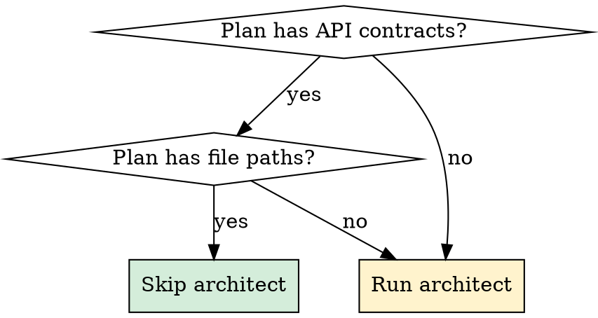

# Team Execute

Execute implementation plans using the `team-dev` multi-agent pipeline. Bridges planning (write-plan, plan mode) with parallel agent execution (team-lead, architect, frontend-dev, backend-dev, test-engineer, qa-engineer, docs-engineer).

## Usage

```bash
/team-execute <plan-file>                    # Execute plan with full pipeline
/team-execute <plan-file> --skip-architect   # Skip architect (plan has contracts)
/team-execute --feature "description"        # No plan file, architect designs from scratch
```

## Parse Arguments

Extract mode and arguments from: `{{ARGUMENTS}}`

```
If ARGS contains a .md file path   → MODE = plan
If ARGS contains --feature "..."   → MODE = feature
If ARGS is empty                   → show help
```

Options:
- `--skip-architect`: Skip Phase 1 (plan already has API contracts + file paths)
- `--dry-run`: Show what would be spawned without executing
- `--feature "description"`: Start from scratch with just a feature description

If no arguments provided, show help:

```
/team-execute - Execute plans with team-dev agents

Usage:
  /team-execute .claude/plans/my-plan.md              Full pipeline
  /team-execute .claude/plans/my-plan.md --skip-arch  Skip architect
  /team-execute --feature "Add user badges system"    From scratch

Pipeline: PLAN → PREPARE → IMPLEMENT → VERIFY → DOCUMENT → CONSOLIDATE
Agents:   architect → context-engineer + test-engineer → backend-dev + frontend-dev → qa + tests → docs
```

---

## MODE: plan

### Trigger
When first argument is a `.md` file path.

### Process

```
STEP 1: Read and Validate Plan
├── Read plan file from path
├── Verify file exists and has content
├── Extract plan title (first H1 or filename)
└── Extract feature description (## Context section or first paragraph)

STEP 2: Analyze Plan Depth
├── Has API contracts (tRPC signatures, Zod schemas)?
│   → Can skip architect if --skip-architect flag
├── Has file paths per task?
│   → Tasks can be routed to correct agents
├── Has tasks grouped by role (Backend/Frontend/Test)?
│   → Direct mapping to agents
└── Store analysis for team-lead prompt

STEP 3: Build Team-Lead Prompt
├── Include: feature title + description
├── Include: full plan content (or summary if >5000 chars)
├── Include: execution mode instructions
│   ├── If --skip-architect: "Plan is pre-approved. Skip Phase 1."
│   │   "Use the plan directly as architect output for Phase 2+."
│   └── If no flag: "Run architect to validate and add API contracts."
│       "Architect should USE this plan as starting point, not start from scratch."
└── Include: any constraints from plan (## Constraints section)

STEP 4: Spawn Team-Lead
├── Use Task tool:
│   {
│     subagent_type: "team-lead",
│     name: "team-lead",
│     description: "Execute plan: {title}",
│     prompt: <built prompt from step 3>,
│     mode: "bypassPermissions"
│   }
└── Team-lead takes over full pipeline from here

STEP 5: Report Launch
├── Print summary of what was launched
├── Show plan title and task count
├── Show execution mode (full pipeline vs skip-architect)
└── Note: "Team-lead is now orchestrating. You'll receive updates as phases complete."
```

### Team-Lead Prompt Template

```markdown
## Feature Request

**Title:** {plan_title}
**Source:** {plan_file_path}

## Execution Mode

{IF skip-architect}
**Mode: SKIP ARCHITECT (Phase 1)**
The plan below is pre-approved with API contracts. Use it directly as architect output.
Start from Phase 2 (PREPARE): spawn test-engineer for scaffolding + context-engineer for briefs.
{ELSE}
**Mode: FULL PIPELINE**
A plan exists but needs architect validation. Spawn architect in plan mode.
The architect should USE the existing plan as starting point — validate, add API contracts
(tRPC signatures, Zod schemas, component interfaces), and submit for approval.
Do NOT start from scratch.
{END}

## Plan Content

{plan_content}

## Constraints

- Follow all team-dev pipeline rules from your agent definition
- If plan has >15 tasks, ask the user to reduce scope
- Ensure all design system rules are followed (semantic tokens, no console.log, etc.)
```

---

## MODE: feature

### Trigger
When `--feature` flag is present.

### Process

```
STEP 1: Extract Feature Description
├── Parse description from --feature "..."
└── If empty: ask user for feature description

STEP 2: Build Team-Lead Prompt
├── Include: feature description
├── No plan content (architect will create)
└── Mode: FULL PIPELINE (architect required)

STEP 3: Spawn Team-Lead
├── Same Task tool call as plan mode
└── Team-lead runs full pipeline from Phase 1

STEP 4: Report Launch
└── Print: "Team-lead spawned for: {description}. Architect will design the plan."
```

---

## MODE: dry-run

When `--dry-run` is present with any mode, show what would happen without executing:

```
Dry Run: team-execute
═══════════════════════════════════════════════════════

Plan: {title}
Tasks: {count} ({backend_count} backend, {frontend_count} frontend, {test_count} test)

Pipeline:
  Phase 1 PLAN:      {SKIP if --skip-architect | architect agent}
  Phase 2 PREPARE:   context-engineer + test-engineer (parallel)
  Phase 3 IMPLEMENT: backend-dev + frontend-dev (parallel)
  Phase 4 VERIFY:    test-engineer + qa-engineer (parallel)
  Phase 5 DOCUMENT:  docs-engineer
  Phase 6 CONSOLIDATE: team-lead final gate

Estimated agents: {count}
Estimated parallel phases: 4 (phases 2-5 have parallelism)

Run without --dry-run to execute.
```

---

## Decision: When to Skip Architect



**API contracts** = tRPC procedure names + Zod input/output types, OR component prop interfaces, OR DB schema definitions.

**File paths** = specific files to create/modify per task.

If BOTH present: safe to skip architect. If EITHER missing: run architect to fill gaps.

---

## Integration with Other Skills

```
┌─────────────────────────────────────────────────────────────┐
│  COMPLETE WORKFLOW                                            │
├─────────────────────────────────────────────────────────────┤
│  1. superpowers:write-plan    → Create plan                  │
│  2. /plan-to-tasks import     → Create TaskNotes (optional)  │
│  3. /team-execute <plan>      → Execute with agents    ← YOU │
│                                                              │
│  Alternative:                                                │
│  1. /team-execute --feature   → Full pipeline from scratch   │
└─────────────────────────────────────────────────────────────┘
```

---

## Error Handling

| Error | Resolution |
|-------|------------|
| Plan file not found | Check path, list `.claude/plans/` |
| Plan has no parseable tasks | Verify plan follows standard format (see plan-to-tasks references) |
| Team-lead reports >15 tasks | Ask user to reduce scope or split into phases |
| Agent BLOCKED >2 times | Team-lead escalates to user automatically |
| Type-check/lint fails | Team-lead routes to responsible dev |

---

## Quick Reference

| What | How |
|------|-----|
| Execute a plan | `/team-execute .claude/plans/my-plan.md` |
| Skip architect | `/team-execute .claude/plans/my-plan.md --skip-architect` |
| From scratch | `/team-execute --feature "Add course badges"` |
| Preview only | `/team-execute .claude/plans/my-plan.md --dry-run` |
| Check team status | `TaskList` (tasks are in team task list) |
